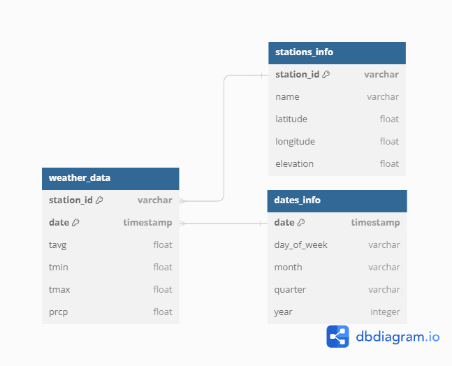

# Solution to study case including additional tasks
The approach followed in this study case was based on providing a solution as automated as possible.
## Pre-requisites
- Python 3.9
- Docker installed
## Validation process
### Docker installation
Several files have been modified to automate processes when running the services:
- Create Postgres tables
- Create S3 buckets (raw & staging)
- Change Airflow metastore from SQLite to Postgress (service: `airflow_postgres`)

Navigate to docker and execute `docker-compose up -d --build`
### Pipeline design
After all the services are up & running, airflow should be accessible from: `localhost:8080`, using `airflow` as the user & password.

There you can find the DAG: `climate_data_ingestion` which is the `data_pipeline.py` file inside `dags` folder.

This pipeline has been developed for:
- By default is retrieving the data corresponding to the previous day of the execution. It is configured as a daily job with scheduling. This way we can improve the performance and scalability.
- In case you need it, you can provide `start_date` and `end_date` at runtime, to define the interval to retrieve data. Having this we can use the same DAG to run historical or daily updates.
- Having `raw` and `staging` layers. Even though staying might be not necessary depending on the use case, it has been designed with it in case other users need to consume the data before loading into final database.
- Including retry policies due to failures from the API during development (error 500).

Once inside Airflow, you can simply enable the DAG to see the first run or trigger it manually.

> **Considerations**: for authentication with the API, the token has been defined in an env variable not pushed to github due to security practices. In case you need to run it, ensure you replace the value of the following variable in docker .env file: `API_TOKEN=<your_token>`. To generate a token consult: https://www.ncdc.noaa.gov/cdo-web/token
### Database design
The design of the database has been developed following more common practices and setups. Even though, some of the databases are not created or managed during the pipeline developed for simplicity.

### Unit testing
For testing purposes some simple scenarios have been created, they can be completed or upgraded with more cases. Under the `dags` folder in airflow, you can find the tests defined in: `test_data_pipeline.py`.

In order to execute the tests:
- Create the venv at root following the case study guide
- Activate the venv following the case study guide
- Install the `requirements_dev.txt` following the case study guide
- Navigate to `dags` folder
- Run: `pytest -v test_data_pipeline.py`